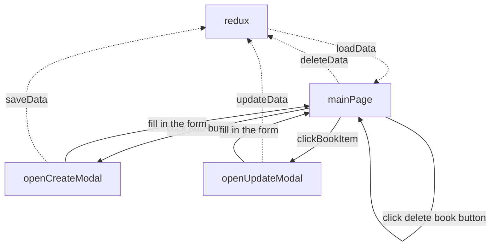

# [techtest] bookstore

this is a technical test for a company Frontend developer with requirement of using React and Redux to create a frontend bookstore

# objective

to create according to detailed requirement

# live demo

# specification

## technical details

-   next.js server side rendering (some of them, you cannot do all server side rendering due to server component are unable to handle interactivity)
-   antd for UI element
-   zod for validation
-   redux toolkit for typesafe redux
-   cypress for e2e testing
-   uses default npm (cause npm comes with nodejs, does not require specific steps such as install extra package or corepack enable)
-   all data should be in session storage (explicitly not add to local storage since in actual implementation, it should be in both local storage and backend with optimistic update, no point to do too much)

## spin up the env

```shell
# clone this repo
cd /root/to/this/repo
npm install
```

### start dev server

```shell
npm run dev
```

### perform cypress testing

```shell
npm run dev
# open another terminal
npm run cypress:open
# follow the instrction on cypress choose e2e and chrome
```

## high level usage

-   dotted line = data flow
-   solid line = UI flow



## limitation and enhancement

-   not all element are pure SSR, SSR could keep large dependencies on Server and reduce client-side javascript, with leveage of cache could provide smoother UX, we could do more component segregation and but non interactive antd component in Server Side
-   no backend implementation, upon implement backend, we can use Redux Thunk, Redux toolkit query, Redux Saga to perform async action directly to redux store
-   more test, current cypress only composite basic e2e test, would need to work with business team to add more test case
-   support to dark mode, and i18n, we could add Navbar and i18n to improve UX

<details>
<summary>NextJS template documentation</summary>
This is a [Next.js](https://nextjs.org/) project bootstrapped with [`create-next-app`](https://github.com/vercel/next.js/tree/canary/packages/create-next-app).

## Getting Started

First, run the development server:

```bash
npm run dev
# or
yarn dev
# or
pnpm dev
# or
bun dev
```

Open [http://localhost:3000](http://localhost:3000) with your browser to see the result.

You can start editing the page by modifying `app/page.tsx`. The page auto-updates as you edit the file.

This project uses [`next/font`](https://nextjs.org/docs/basic-features/font-optimization) to automatically optimize and load Inter, a custom Google Font.

## Learn More

To learn more about Next.js, take a look at the following resources:

-   [Next.js Documentation](https://nextjs.org/docs) - learn about Next.js features and API.
-   [Learn Next.js](https://nextjs.org/learn) - an interactive Next.js tutorial.

You can check out [the Next.js GitHub repository](https://github.com/vercel/next.js/) - your feedback and contributions are welcome!

## Deploy on Vercel

The easiest way to deploy your Next.js app is to use the [Vercel Platform](https://vercel.com/new?utm_medium=default-template&filter=next.js&utm_source=create-next-app&utm_campaign=create-next-app-readme) from the creators of Next.js.

Check out our [Next.js deployment documentation](https://nextjs.org/docs/deployment) for more details.

</details>
